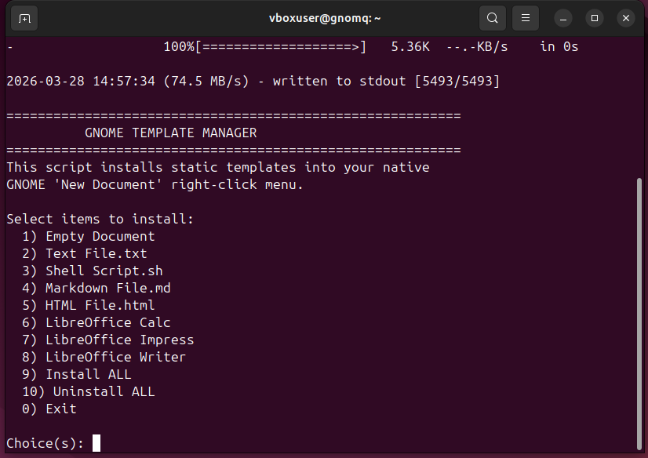
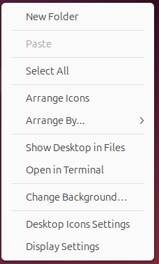
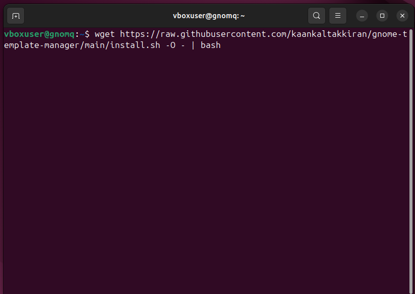
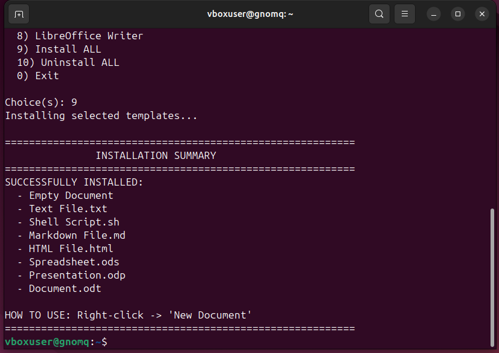
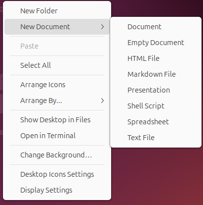
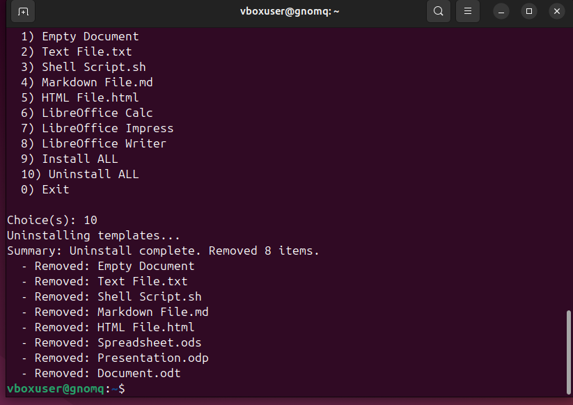

# 🧩 GNOME Template Manager

<p align="center">
   
</p>

<p align="center">
  <strong>Automate your GNOME "New Document" menu with native system templates.</strong>
</p>

<p align="center">
  <a href="LICENSE"></a>
</p>

---

**GNOME Template Manager** is a lightweight utility designed to bridge the gap in GNOME's "New Document" functionality. It installs a curated set of standard file templates (LibreOffice, Text, Markdown, etc.) directly into your `~/Templates` directory, making them instantly available in your right-click menu across the entire system.

### 📽️ Demo

[video.webm](https://github.com/user-attachments/assets/294d9e73-5051-49c9-82d5-5dfafe73d592)


---

## ✨ Key Highlights

-   **🎯 Native Integration**: Zero-overhead installation into `~/Templates` for 100% compatibility.
-   **🔍 Dynamic Detection**: Automatically scans for **LibreOffice** and provides templates only if installed.
-   **🌍 Smart Localization**: Uses `gettext` to detect your system language and name files natively (Turkish, English, etc.).
-   **🖥️ Desktop Support**: Full functionality when right-clicking on the desktop background.
-   **📊 Success Summary**: Clean CLI output showing exactly what was added or removed.

---

## 📸 Showcase

<p align="center">
  
  
</p>
<p align="center">
  
  
</p>
<p align="center">
  
  
</p>

---

## 📥 Installation

Get up and running with a single command:

```bash
wget https://raw.githubusercontent.com/kaankaltakkiran/gnome-template-manager/main/install.sh -O - | bash
```

## 🛠️ How to Use

1.  **Right-click** anywhere (Desktop or inside any folder).
2.  Navigate to **"New Document"**.
3.  Select your desired file type to create it instantly.

## 🗑️ Uninstallation

If you wish to remove the templates, simply run the script and select **Option 10** for a clean removal.

---


## 🤝 Contributing

Contributions are welcome! Feel free to open an issue or submit a pull request to add more templates or improve localization.

---
## Star History

<a href="https://www.star-history.com/?repos=gnome-template-manager%2Fgnome-template-manager&type=timeline&legend=bottom-right">
 <picture>
   <source media="(prefers-color-scheme: dark)" srcset="https://api.star-history.com/image?repos=gnome-template-manager/gnome-template-manager&type=timeline&theme=dark&logscale&legend=bottom-right" />
   <source media="(prefers-color-scheme: light)" srcset="https://api.star-history.com/image?repos=gnome-template-manager/gnome-template-manager&type=timeline&logscale&legend=bottom-right" />
   
 </picture>
</a>

---

<p align="center">
  <a href="https://github.com/kaankaltakkiran">
    
  </a>
  <br>
  <strong>Developed by <a href="https://github.com/kaankaltakkiran">Kaan Kaltakkıran</a></strong>
</p>
